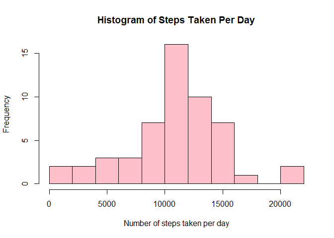
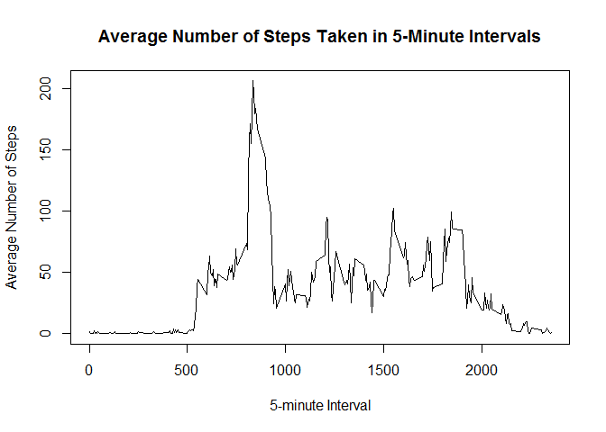
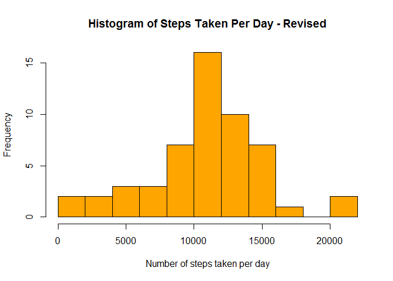
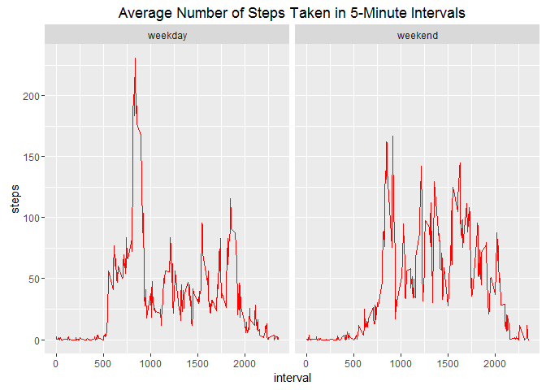

# Reproducible Research: Peer Assessment 1


## Loading and preprocessing the data


```r
activity <- read.csv("activity.csv")
```

## What is mean total number of steps taken per day?


```r
totStepsperDay <- aggregate(steps ~ date, activity, sum)
hist(totStepsperDay$steps, col = "pink", breaks = 10, xlab = "Number of steps taken per day", main = "Histogram of Steps Taken Per Day")
```

<!-- -->

```r
meanSteps <- mean(totStepsperDay$steps)
medSteps <- median(totStepsperDay$steps)
meanSteps <- as.integer(meanSteps)
```

The mean and median of the total steps taken were r meanSteps and r medSteps.
meanSteps = 10766
medSteps = 10765

## What is the average daily activity pattern?

Make a time series plot (i.e. type = "l") of the 5-minute interval (x-axis) and show the average number of steps taken, averaged across all days (y-axis)

Exclude NA values


```r
clean <- activity[!is.na(activity$steps),]
```


```r
avgStepInt <- aggregate(steps ~ interval, activity, mean)
plot(avgStepInt$interval, avgStepInt$steps, type = "l", ylab = "Average Number of Steps", xlab = "5-minute Interval", main = "Average Number of Steps Taken in 5-Minute Intervals")
```

<!-- -->

```r
maxIntRow <- avgStepInt[which.max(avgStepInt$steps),]
```

For all the days in the dataset on average, the 5-minute interval, r maxIntRow[1,1], contains the maximum number of steps, r as.integer(maxIntRow[1,2])

## Imputing missing values

Calculate the number of rows in the dataset that contains NA in the "steps" column. Substitute the NAs with the average number of steps for that interval over all the days studied. Plot histogram using the revised dataset and compare with the histogram created int the Step 2 above.


```r
naRows <- is.na(activity$steps)
numNARows <- nrow(activity[naRows,])
times <- length(unique(activity$date))
avgRepeat <- rep(avgStepInt$steps, times)
for (i in 1:length(naRows)) {
        activity$steps[i] <- ifelse(is.na(activity$steps[i]), avgRepeat[i], activity$steps[i])
}

totStepsperDay2 <- aggregate(steps ~ date, activity, sum)
hist(totStepsperDay$steps, col = "orange", breaks = 10, xlab = "Number of steps taken per day", main = "Histogram of Steps Taken Per Day - Revised")
```

<!-- -->

```r
meanSteps2 <- mean(totStepsperDay$steps)
medSteps2 <- median(totStepsperDay$steps)
meanSteps2 <- as.integer(meanSteps2)
```

The mean and median of the revised total steps taken were 10766 and 10765, respectively, and those numbers are the same as the original mean and median obtained before we replace NAs with average number of steps for the corresponding interval. Similarly, the original and revised histograms are identical.

## Are there differences in activity patterns between weekdays and weekends?

Create a new factor variable in the dataset with two levels - "weekday" and "weekend" indicating whether a given date is a weekday or weekend day.

Make a panel plot containing a time series plot (i.e. type = "l") of the 5-minute interval (x-axis) and the average number of steps taken, averaged across all weekday days or weekend days (y-axis). See the README file in the GitHub repository to see an example of what this plot should look like using simulated data.


```r
library(lubridate)
```

```
## Warning: package 'lubridate' was built under R version 3.3.1
```

```
## 
## Attaching package: 'lubridate'
```

```
## The following object is masked from 'package:base':
## 
##     date
```

```r
activity$date <- ymd(activity$date)
activity[["wkend"]] <- as.factor(ifelse(weekdays(activity$date)=="Sunday"|weekdays(activity$date)=="Saturday", "weekend","weekday"))
library(ggplot2)
```

```
## Warning: package 'ggplot2' was built under R version 3.3.1
```

```r
p <- ggplot(data=activity, aes(interval, steps))
p + stat_summary(fun.y = mean, col = "red", geom = "line") + facet_wrap(~ wkend) + ggtitle("Average Number of Steps Taken in 5-Minute Intervals")
```

<!-- -->

Yes, weekends show a higher level of activity throughout the day whereas weekdays show higher peaks of activity in the earlier hours of the day with a slight peak in the early evening hours.

